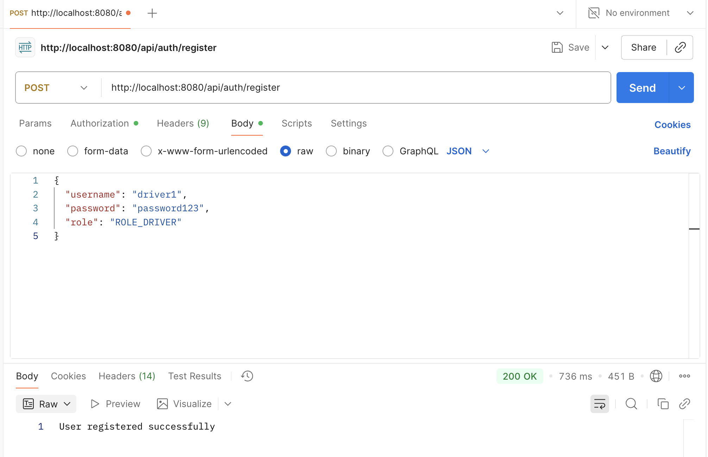
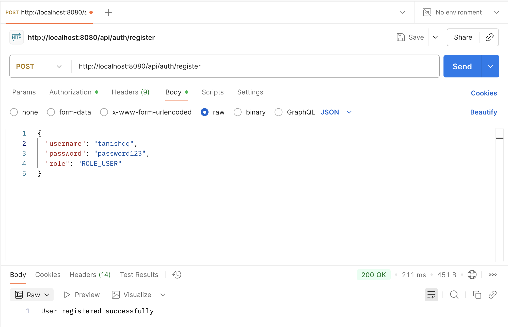
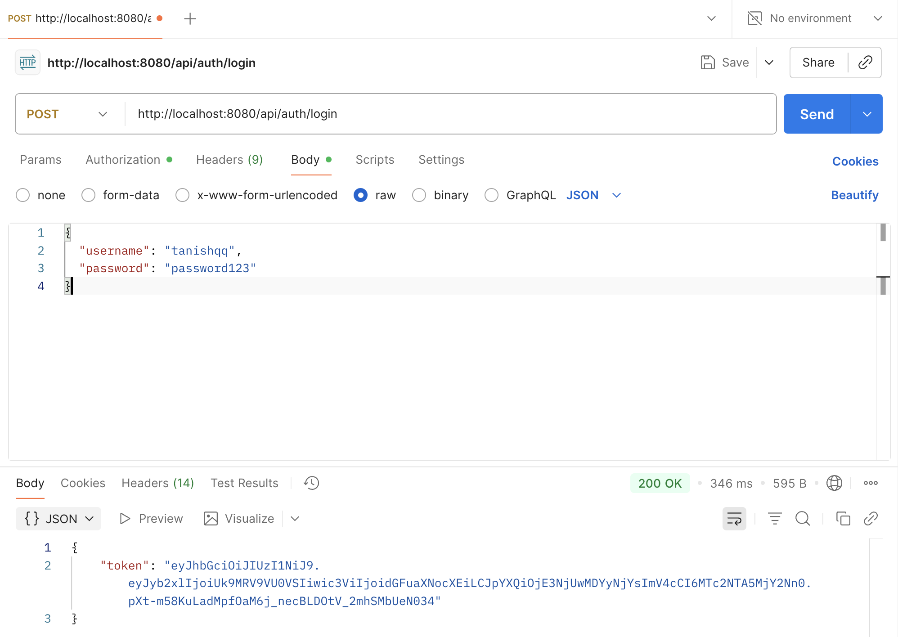
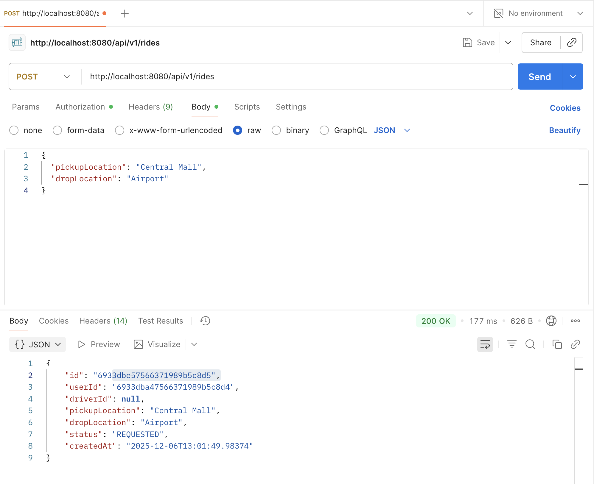

# 🚖 RideShare Backend API

A complete backend system for a ride-sharing application (like Uber) built with **Spring Boot** and **MongoDB**. This API handles user registration, secure login with JWT, ride booking, and driver operations.

## 📋 Project Overview

This project implements a secure REST API that allows two types of users (`PASSENGER` and `DRIVER`) to interact.
- **Passengers** can book rides.
- **Drivers** can view pending requests and accept them.
- The system tracks the ride status from `REQUESTED` -> `ACCEPTED` -> `COMPLETED`.
- All endpoints (except login/register) are secured using **JWT (JSON Web Tokens)**.

## 🛠️ Tech Stack

* **Java  17**
* **Spring Boot 3.2.1** (Web, Security, Validation)
* **MongoDB Atlas** (Cloud Database)
* **Spring Data MongoDB**
* **JJWT** (For token generation and validation)
* **Maven** (Build tool)

---

## ⚙️ Setup & Installation

### 1. Prerequisites
* Java 17 or newer installed.
* Maven installed (or use the provided `mvnw` wrapper).
* A running MongoDB cluster (Atlas or Local).

### 2. Configure Database
Update the `src/main/resources/application.yaml` file with your database credentials:

```yaml
spring:
  data:
    mongodb:
      uri: mongodb+srv://<username>:<password>@cluster0.mongodb.net/?retryWrites=true&w=majority
      database: Uber_Tanishq

jwt:
  secret: <YOUR_LONG_SECRET_KEY>
  expiration: 86400000 # 24 hours
````

### 3\. Run the Application

Open a terminal in the project root and run:

```bash
./mvnw spring-boot:run
```

The server will start at `http://localhost:8080`.

-----

## 🔌 API Endpoints

### 🔐 Authentication (Public)

| Method | URL | Description | Request Body |
| :--- | :--- | :--- | :--- |
| `POST` | `/api/auth/register` | Register a new user | `{"username": "...", "password": "...", "role": "ROLE_USER"}` |
| `POST` | `/api/auth/login` | Login to get a Token | `{"username": "...", "password": "..."}` |

### 🚕 Passenger Operations (Requires `ROLE_USER`)

| Method | URL | Description | Request Body |
| :--- | :--- | :--- | :--- |
| `POST` | `/api/v1/rides` | Book a new ride | `{"pickupLocation": "...", "dropLocation": "..."}` |
| `GET` | `/api/v1/user/rides` | View my ride history | *None* |

### 🚗 Driver Operations (Requires `ROLE_DRIVER`)

| Method | URL | Description | Request Body |
| :--- | :--- | :--- | :--- |
| `GET` | `/api/v1/driver/rides/requests` | View pending rides | *None* |
| `POST` | `/api/v1/driver/rides/{id}/accept` | Accept a ride | *None* |

### 🏁 Shared Operations

| Method | URL | Description | Request Body |
| :--- | :--- | :--- | :--- |
| `POST` | `/api/v1/rides/{id}/complete` | Mark ride as completed | *None* |

-----

## 🧪 Testing Guide (Postman)

Since the API is secured, you **cannot** test it in a browser. Use Postman.

1.  **Register a User:**
    * POST `http://localhost:8080/api/auth/register`
    * Body (JSON): `{"username": "alice", "password": "123", "role": "ROLE_USER"}`
2.  **Login:**
    * POST `http://localhost:8080/api/auth/login`
    * Body (JSON): `{"username": "alice", "password": "123"}`
    * **Copy the `token`** from the response.
3.  **Make Authenticated Requests:**
    * For any `/api/v1/` request, go to the **Authorization** tab in Postman.
    * Select **Type: Bearer Token**.
    * Paste the token you copied.
    * Send the request.

-----

## 📂 Project Structure

```
src/main/java/com/tanishq/uber/
├── config/             # Security configurations (SecurityConfig.java)
├── controller/         # API Endpoints (AuthController, RideController)
├── dto/                # Data Transfer Objects (Requests/Responses)
├── model/              # Database Entities (User, Ride)
├── repository/         # MongoDB Interfaces
├── security/           # JWT Filter and Utility classes
└── service/            # User logic (CustomUserDetailsService)
```

-----


# HERE ARE THE SCREENSHOTS OF THE WORKING DEMO # 

# PICTURE 1 ) 


# PICTURE 2) 



# PICTURE 2)



# PICTURE 2)



**Developed by:** Tanishq

```
```